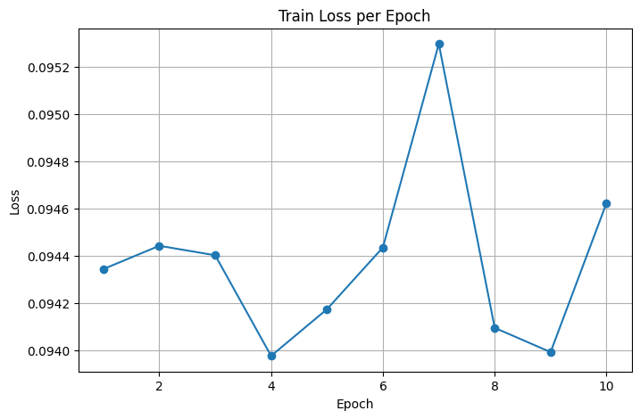
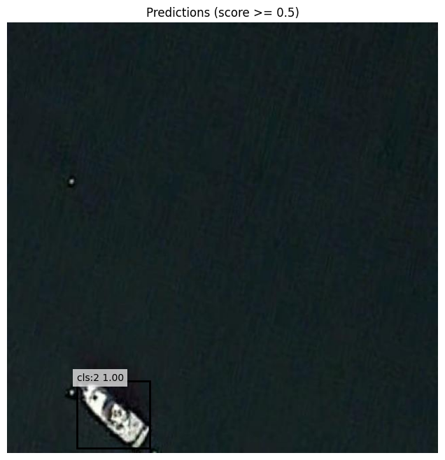

# 🚢 Ship Detection from Aerial Images using Faster R-CNN

This repository demonstrates **Object Detection for ships in aerial imagery** using the **Faster R-CNN** deep learning architecture.  
The project focuses on building a robust model capable of detecting ships from top-view satellite images for maritime monitoring, surveillance, coastal management, and port automation.

---

## 📌 Dataset
**Dataset Name:** Ship Detection from Aerial Image (Roboflow Universe)  
**Source:** Roboflow Public Dataset  
**Link:**  
https://universe.roboflow.com/cs435/ship-detection-from-aerial-image-7qqyb

**Format Used:** COCO (images + annotation JSON)  
**Classes:** Ship (Single-class detection task)

Data organization:
dataset/
├── train/
├── valid/
├── test/
├── annotations/
├── instances_train.json
├── instances_val.json
├── instances_test.json

---

## 🧠 Model Architecture

We trained the model using:
- **Faster R-CNN (ResNet-50 FPN Backbone)**
- **PyTorch & Torchvision Implementation**
- **GPU Execution (Google Colab)**

Key Highlights:
- Custom COCO data loader
- Per-epoch evaluation (Precision, Recall, F1-Score)
- COCO mAP, AP50, AP75 metrics calculated
- Inference visualization for performance inspection

---

## 🚀 Training Environment

| Component        | Configuration |
|------------------|----------------|
| Framework        | PyTorch (torchvision detection) |
| Model            | Faster R-CNN ResNet50-FPN |
| Dataset Format   | COCO |
| Hardware         | GPU (Colab / T4 / Tesla) |
| Epochs Trained   | 10 |
| Loss Function    | Region-based loss (bbox + classification) |
| Evaluation       | PRF metrics + COCO mAP |

---

## 📊 Final Evaluation Results (After 10 Epochs)

| Metric                  | Score      |
|-------------------------|------------|
| **Train Loss**          | `0.0946`   |
| **Precision @ 0.50**    | `0.7766`   |
| **Recall @ 0.50**       | `0.8202`   |
| **F1-Score @ 0.50**      | `0.7978`   |
| **AP50 (IoU 0.5)**      | `0.8312`   |
| **AP75 (IoU 0.75)**     | `0.6919`   |
| **COCO mAP**            | `-1.0000`* |

> **Note:** COCO mAP returned `-1.0000` due to category mismatch or evaluation threshold conflict; fixing category-ID mapping typically resolves this.

🤝 Collaboration & Opportunities
We are open to:
✔ Research collaboration
✔ Industry pilot projects
✔ Edge deployment & model optimization
✔ Dataset sharing & annotation partnerships

If you want to collaborate, improve this model, or deploy it in real environments — feel free to reach out!
📩 Email: sanacheema887@gmail.com
🌐 GitHub: https://github.com/yourprofile
💼 LinkedIn: https://www.linkedin.com/in/sanacheema-ml-ai/

Let’s build something impactful together in Computer Vision & Maritime AI.
